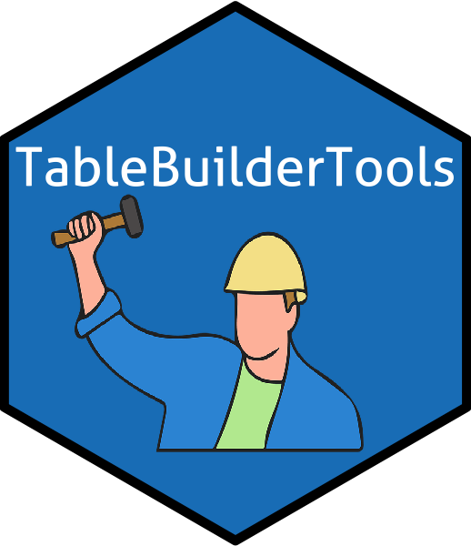

<!-- README.md is generated from README.Rmd. Please edit that file -->

# TableBuilderTools 

<!-- badges: start -->

<!-- badges: end -->

The goal of TableBuilderTools is to provide utility functions for
working with tables generated by [ABS
TableBuilder](https://auth.censusdata.abs.gov.au/webapi/jsf/tableView/tableView.xhtml).

## Installation

You can install TableBuilderTools with the `remotes` package in R..

``` r
remotes::install_github("asiripanich/TableBuilderTools")
```
